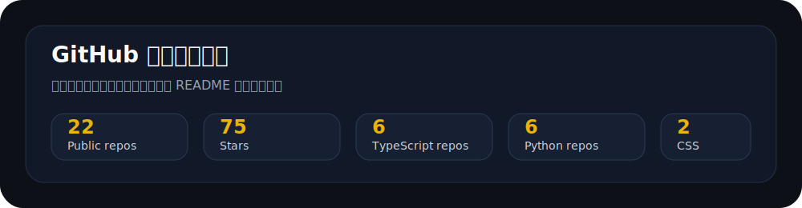

  

<h1 align="center">webkubor</h1>

  <b>Building local-first AI tools, creative workflows, and agent-reusable skills.</b>

  
  
  
  
  

---

## What I'm building

I care about AI tools that fit into real workflows, not one-off demos.

- **Agent tooling** — telemetry, key management, cost routing. Things that make AI agents safer and cheaper to run.
- **Local AI workstations** — TTS, ASR, and creative tools that run on your machine, not someone else's cloud.
- **Developer aesthetics** — themes, editors, and writing tools for people who stare at screens all day.

---

## Pinned projects

<table>
  <tr>
    <td width="50%" valign="top">
      <h3><a href="https://github.com/webkubor/typora-Bloom-theme">Typora Bloom Theme</a> &nbsp;⭐80</h3>
      
A calm Typora theme for long-form writing, focused reading, and aesthetic markdown publishing.

      
<code>CSS</code> <code>Markdown</code> <code>Writing</code>

    </td>
    <td width="50%" valign="top">
      <h3><a href="https://github.com/webkubor/vite-plugin-agent-eyes">vite-plugin-agent-eyes</a></h3>
      
Give AI agents runtime visibility — Vite self-healing telemetry plugin. 1.8k+ weekly npm downloads.

      
<code>Vite</code> <code>Telemetry</code> <code>DevTools</code> <code>npm</code>

    </td>
  </tr>
  <tr>
    <td width="50%" valign="top">
      <h3><a href="https://github.com/webkubor/voice-editor">声音编辑器</a> &nbsp;⭐3</h3>
      
本地中文 TTS 工作台，面向人类、AI 与 agent。基于 Qwen3-TTS，支持声音克隆与多角色对话。

      
<code>Python</code> <code>TTS</code> <code>Local AI</code>

    </td>
    <td width="50%" valign="top">
      <h3><a href="https://github.com/webkubor/keyring">Keyring</a> &nbsp;⭐2</h3>
      
AI-era key management. Store once, agents never see plaintext. AES-256-GCM cloud encryption.

      
<code>Security</code> <code>Agent Skills</code> <code>AES-256-GCM</code>

    </td>
  </tr>
  <tr>
    <td width="50%" valign="top">
      <h3><a href="https://github.com/webkubor/ego-lite">ego-lite</a></h3>
      
The best browser for both you and your AI agents to work in parallel.

      
<code>Browser</code> <code>Agent</code> <code>Automation</code>

    </td>
    <td width="50%" valign="top">
      <h3><a href="https://github.com/webkubor/omni-chatbot-sdk">Omni Chatbot SDK</a></h3>
      
Frontend AI chat SDK for React / Vue with custom LLM backends. Ship branded chat interfaces fast.

      
<code>TypeScript</code> <code>React</code> <code>Vue</code> <code>LLM</code>

    </td>
  </tr>
  <tr>
    <td width="50%" valign="top">
      <h3><a href="https://github.com/webkubor/xiaobai-kanban">xiaobai-kanban</a></h3>
      
AI Agent driven beginner dev guide — you just talk, the agent handles GitLab/GitHub.

      
<code>Agent</code> <code>GitLab</code> <code>Tutorial</code>

    </td>
    <td width="50%" valign="top">
      <h3><a href="https://github.com/webkubor/asr-studio">ASR Studio</a></h3>
      
Local speech-to-text workstation for creators and agents.

      
<code>Python</code> <code>ASR</code> <code>Local AI</code>

    </td>
  </tr>
</table>

---

## GitHub Stats

  

---

  Turn one-off experience into reusable tools. Build in public.

