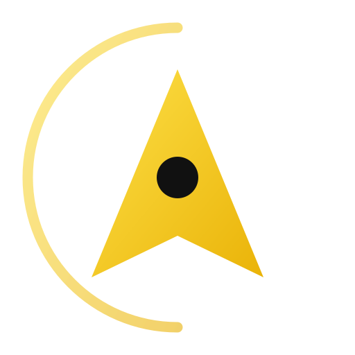

  

<h1 align="center">AetherFleet 指挥中心</h1>

  <b>捕获 AI 美学精髓，构建本地优先的 Agent 基础设施。</b>

  
  
  

---

### 🛰️ 核心舱位 (基础设施)
<!-- 由 UI 设计师与视觉叙事者协作完成 -->
<table>
  <tr>
    <td width="50%" valign="top">
      <h4>🧠 Alpha 模块: CortexOS</h4>
      
<i>AI Agent 的记忆与控制平面。</i>

      
建立大语言模型与本地上下文之间的突触连接。

      <code>TypeScript</code> <code>Agentic Memory</code> <code>MCP</code>
    </td>
    <td width="50%" valign="top">
      <h4>🎨 Beta 模块: Prompt Lab</h4>
      
<i>创意 AI 视觉工作流库。</i>

      
在大规模环境下编排 Midjourney 与 Stable Diffusion。

      <code>Creative-AI</code> <code>Workflow</code> <code>Visuals</code>
    </td>
  </tr>
  <tr>
    <td width="50%" valign="top">
      <h4>🌸 Gamma 模块: Typora Bloom</h4>
      
<i>极简主义写作美学。</i>

      
消除噪音，专为深度专注的长篇写作而设计。

      <code>CSS</code> <code>Aesthetics</code> <code>Writing</code>
    </td>
    <td width="50%" valign="top">
      <h4>🍌 Delta 模块: Nano Banana+</h4>
      
<i>Gemini CLI 的创意增强工具。</i>

      
为命令行注入趣味性与更强大的处理能力。

      <code>Go</code> <code>CLI</code> <code>Gemini</code>
    </td>
  </tr>
</table>

---

### 📡 系统遥测 (性能监控)
<!-- 采用 Aureate Gold (金金色) 统一定制 -->

  
  

---

### 🛸 通讯上行

  
  

  <i>"在噪音的世界中，构建清晰的秩序。" —— AetherFleet 协议 v1.4.2</i>

